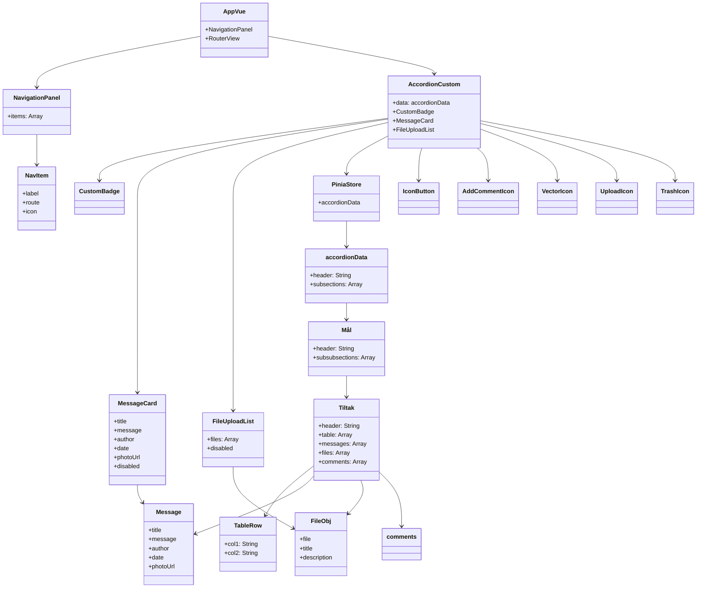

# .

This template should help get you started developing with Vue 3 in Vite.

## Recommended IDE Setup

[VSCode](https://code.visualstudio.com/) + [Volar](https://marketplace.visualstudio.com/items?itemName=Vue.volar) (and disable Vetur).

## Customize configuration

See [Vite Configuration Reference](https://vite.dev/config/).

## Project Setup

```sh
npm install
```

### Compile and Hot-Reload for Development

```sh
npm run dev
```

### Compile and Minify for Production

```sh
npm run build
```

# Prototype Vue Project

## Component & Data UML Diagram



## Data Structure
- `accordionData`: Array of Nivå (sections)
  - `header`: String
  - `subsections`: Array of Mål
    - `header`: String
    - `subsubsections`: Array of Tiltak
      - `header`: String
      - `table`: Array of { col1, col2 }
      - `messages`: Array of { title, message, author, date, photoUrl }
      - `files`: Array of { file, title, description }
      - `comments`: Array of String
- `NavigationPanel`: items[] { label, route, icon? }
- `FileUploadList`: files[] { file, title, description }
- `MessageCard`: { title, message, author, date, photoUrl, disabled }

## Legend
- Components use props and events to communicate.
- Pinia store provides shared state (`accordionData`).
- NavigationPanel controls routing.

---

For a visual diagram, paste the Mermaid code above into a Mermaid live editor or supported Markdown viewer.
